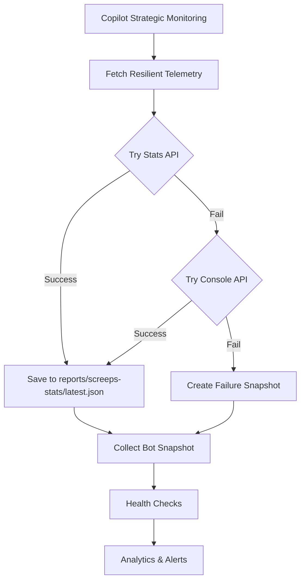

# Screeps Monitoring Fix - Technical Summary

## Problem Statement

The Screeps monitoring system was broken, with bot snapshots containing only timestamps and no actual game data. The monitoring workflow was failing to collect telemetry from the Screeps API.

## Root Causes Identified

### 1. Broken ScreepsAPI Integration in MCP Client

**File:** `packages/screeps-mcp/src/screeps/client.ts`

**Issue:** The code was using `ScreepsAPI.fromConfig(serverUrl)` which doesn't exist in the `screeps-api` library.

**Evidence:**
```typescript
// BROKEN CODE:
const serverUrl = `${this.config.protocol}://${this.config.host}:${this.config.port}`;
this.api = await ScreepsAPI.fromConfig(serverUrl);
```

The `screeps-api` library (v1.16.1) doesn't provide a `fromConfig` static method. Looking at working examples in the codebase (deploy.ts, check-bot-aliveness.ts, fetch-console-telemetry.ts), the correct pattern is:

```typescript
const api = new ScreepsAPI({ token, hostname, protocol, port, path });
```

**Fix Applied:**
```typescript
// FIXED CODE:
this.api = new ScreepsAPI({
  token: this.config.token,
  email: this.config.email,
  password: this.config.password,
  hostname: this.config.host,
  protocol: this.config.protocol,
  port: this.config.port,
  path: "/"
});
```

Additionally, fixed the authentication flow:
- Token authentication is configured in the constructor (no separate auth call needed)
- Email/password authentication requires calling `await api.auth(email, password)`

### 2. Incorrect Script Paths in Copilot Monitoring Prompt

**File:** `.github/copilot/prompts/screeps-monitor`

**Issue:** The Copilot monitoring agent was instructed to run scripts using incorrect paths (`scripts/` instead of `packages/utilities/scripts/`).

**Evidence:**
```bash
# BROKEN PATH:
npx tsx scripts/fetch-resilient-telemetry.ts
```

The scripts are actually located in `packages/utilities/scripts/`, so this command would fail with "file not found" errors.

**Fix Applied:**
Updated all script references in the prompt:
- `scripts/fetch-resilient-telemetry.ts` → `packages/utilities/scripts/fetch-resilient-telemetry.ts`
- `scripts/fetch-screeps-stats.mjs` → `packages/utilities/scripts/fetch-screeps-stats.mjs`
- `scripts/check-bot-aliveness.ts` → `packages/utilities/scripts/check-bot-aliveness.ts`
- `scripts/fetch-console-telemetry.ts` → `packages/utilities/scripts/fetch-console-telemetry.ts`

## How Monitoring Works (Architecture)

### Monitoring Workflow Flow



### Component Responsibilities

1. **Copilot Strategic Monitoring** (uses screeps-mcp MCP server)
   - Authenticates with GitHub and Screeps
   - Executes resilient telemetry fetch
   - Analyzes bot performance and repository health

2. **Resilient Telemetry Fetch** (`fetch-resilient-telemetry.ts`)
   - Primary: Fetch from Stats API (`/api/user/stats`)
   - Fallback: Fetch from Console API (direct bot queries)
   - Creates failure snapshot if both fail

3. **Bot Snapshot Collection** (`collect-bot-snapshot.ts`)
   - Reads stats from `reports/screeps-stats/latest.json`
   - Transforms data into snapshot format
   - Falls back to console telemetry if needed

4. **Health Checks** (`check-bot-health.ts`)
   - Validates PTR stats availability
   - Checks bot aliveness via world-status API
   - Implements graduated alert levels (warning, high, critical)

## Impact of Fixes

### Before Fix
- ScreepsClient.connect() would throw error: "ScreepsAPI.fromConfig is not a function"
- Copilot monitoring would fail to execute telemetry scripts (file not found)
- No stats data collected → snapshots only had timestamps
- Monitoring alerts would be generated incorrectly

### After Fix
- ScreepsClient properly initializes API connection
- Copilot can execute telemetry scripts successfully
- Stats API or Console fallback populates data
- Bot snapshots contain actual game data (CPU, rooms, creeps, resources)
- Health checks work correctly with real data

## Testing Recommendations

To verify the fix works:

1. **Run the monitoring workflow manually:**
   ```bash
   gh workflow run screeps-monitoring.yml
   ```

2. **Check that stats are collected:**
   ```bash
   cat reports/screeps-stats/latest.json
   # Should contain: fetchedAt, endpoint, payload.stats
   ```

3. **Verify bot snapshots have data:**
   ```bash
   cat reports/bot-snapshots/snapshot-$(date +%Y-%m-%d).json
   # Should contain: timestamp, cpu, rooms, creeps, spawns, tick
   ```

4. **Test MCP server directly (if needed):**
   ```bash
   SCREEPS_TOKEN=xxx node packages/screeps-mcp/src/server.ts
   # Should start without errors
   ```

## Reference: node-screeps-api Documentation

Based on the [node-screeps-api](https://github.com/screepers/node-screeps-api) repository:

### Initialization
```javascript
const ScreepsAPI = require('screeps-api');
const api = new ScreepsAPI({
  token: 'xxx',
  hostname: 'screeps.com',
  protocol: 'https',
  port: 443,
  path: '/'
});
```

### Authentication
```javascript
// Token auth (set in constructor)
const api = new ScreepsAPI({ token: 'xxx' });

// Email/password auth (requires auth call)
const api = new ScreepsAPI({ email: 'user@example.com', password: 'pass' });
await api.auth(email, password);
```

### Console Commands
```javascript
const result = await api.console('Game.time', 'shard3');
console.log(result.data); // Command output
```

### Memory Access
```javascript
const memory = await api.memory.get('_shard_shard3', 'rooms.W1N1');
await api.memory.set('_shard_shard3', 'config.autoSpawn', true);
```

## Files Modified

1. `packages/screeps-mcp/src/screeps/client.ts`
   - Fixed `connect()` method to use proper ScreepsAPI constructor
   - Fixed authentication flow for token vs email/password
   - Added proper credential validation

2. `.github/copilot/prompts/screeps-monitor`
   - Updated all script paths from `scripts/` to `packages/utilities/scripts/`
   - Fixed 5 script references total

## Conclusion

The monitoring system was broken due to two issues:
1. Incorrect API initialization using non-existent method
2. Wrong script paths preventing Copilot from executing telemetry collection

Both issues have been fixed. The monitoring workflow should now successfully collect telemetry data, populate bot snapshots with actual game data, and perform health checks correctly.
