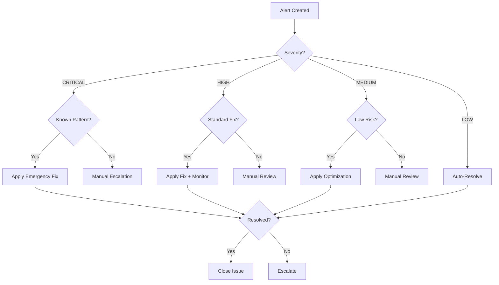

# Monitoring Alert Playbook

## Overview

This playbook defines standardized procedures for responding to PTR monitoring alerts generated by the Screeps GPT autonomous monitoring system. It provides clear guidance on alert classification, response procedures, and decision criteria for autonomous vs. manual intervention.

**Purpose**: Enable Copilot workflows to autonomously triage and respond to monitoring alerts while escalating complex issues appropriately, reducing manual intervention and improving system reliability.

**Related Documentation**:

- [CPU Timeout Diagnostic Runbook](./cpu-timeout-diagnosis.md) - CPU timeout diagnosis and resolution
- [Performance Optimization Guide](./performance-optimization.md) - Optimization strategies
- [Stats Monitoring](./stats-monitoring.md) - PTR monitoring setup and configuration

---

## Table of Contents

1. [Alert Classification System](#alert-classification-system)
2. [Response Procedures](#response-procedures)
3. [Escalation Criteria](#escalation-criteria)
4. [Auto-Resolution Guidelines](#auto-resolution-guidelines)
5. [Alert Decision Trees](#alert-decision-trees)

---

## Alert Classification System

### Severity Levels

All monitoring alerts are classified into four severity levels based on impact and urgency:

#### CRITICAL

**Definition**: Immediate threat to bot operation requiring urgent response

**Characteristics**:

- Bot functionality severely impaired or halted
- Game progress at risk
- Spawns lost or dying
- Script execution failures

**Response Time**: Immediate (<5 minutes)

**Examples**:

- CPU timeout (script execution halted)
- All spawns lost
- CPU bucket <500 (timeout risk imminent)
- PTR telemetry blackout >2 hours
- Respawn required

**Auto-resolution**: Limited - Notify and apply emergency mitigations only

#### HIGH

**Definition**: Significant performance degradation requiring prompt attention

**Characteristics**:

- Bot performance notably degraded
- Risk of escalation to CRITICAL
- Resource constraints approaching limits
- Monitoring system issues

**Response Time**: <30 minutes

**Examples**:

- CPU usage >95% sustained
- CPU bucket 500-1000
- Memory corruption detected
- Energy critically low (<300 in storage)
- Spawn queue backlog >5 creeps

**Auto-resolution**: Moderate - Apply standard fixes and monitor

#### MEDIUM

**Definition**: Performance issues requiring investigation and optimization

**Characteristics**:

- Bot functioning but suboptimally
- No immediate risk
- Optimization opportunity
- Trend analysis indicates potential future issues

**Response Time**: <2 hours

**Examples**:

- CPU usage 80-95%
- CPU bucket 1000-2000
- Pathfinding inefficient
- Creep role imbalance
- Room controller downgrade risk (>5% time left)

**Auto-resolution**: High - Full autonomous resolution encouraged

#### LOW

**Definition**: Minor issues or informational alerts

**Characteristics**:

- Minimal or no impact
- Informational
- Long-term optimization opportunity
- Normal operational variations

**Response Time**: <24 hours

**Examples**:

- CPU usage 70-80%
- CPU bucket 2000-5000
- Room upgrade progress
- Creep count changes
- Normal performance variations

**Auto-resolution**: Full - Autonomous handling expected

---

## Response Procedures

### CRITICAL Severity Alerts

#### CPU Timeout

**Alert Pattern**:

```
Title: CPU timeout at main:XXX:XX on shardN
Labels: monitoring, performance, type/bug, priority/critical
```

**Response Procedure**:

1. **Verify Impact** (0-1 min)

   ```bash
   # Check bot status
   curl -H "X-Token: $SCREEPS_TOKEN" https://screeps.com/api/user/console
   ```

2. **Emergency Mitigation** (1-5 min)
   - Apply emergency CPU reduction (see [CPU Timeout Diagnostic Runbook](./cpu-timeout-diagnosis.md#emergency-response))
   - Disable non-critical features
   - Reduce safety margins

3. **Document Incident** (5-10 min)
   - Add to [CPU Timeout Incident Tracking](./cpu-timeout-incidents.md)
   - Capture stack trace and telemetry
   - Link to related incidents

4. **Assess Pattern** (10-15 min)
   - Check for systematic pattern (3+ incidents in 24h)
   - Review historical incidents
   - Determine if architectural intervention needed

5. **Escalate or Resolve**
   - **If systematic**: Coordinate with architectural solutions (#364, #392, #396)
   - **If isolated**: Apply tactical fix and monitor 24h

**Auto-resolution Conditions**:

- ✅ First occurrence (isolated incident)
- ✅ Known resolution pattern
- ✅ CPU spike <100% (didn't timeout)
- ✅ Bucket >1000 after incident

**Manual Escalation Conditions**:

- ❌ 2+ incidents in 6 hours (systematic pattern)
- ❌ Unknown root cause
- ❌ Bucket <500 sustained
- ❌ All tactical fixes exhausted

#### All Spawns Lost

**Alert Pattern**:

```
Title: All spawns lost on shardN - respawn required
Labels: monitoring, respawn, type/bug, priority/critical
```

**Response Procedure**:

1. **Verify Spawn Status** (0-1 min)

   ```javascript
   // In-game console
   console.log("Spawns:", Object.keys(Game.spawns).length);
   console.log("GCL:", Game.gcl.level);
   ```

2. **Trigger Respawn** (1-2 min)
   - Automated by `.github/workflows/deploy.yml` spawn monitoring
   - Respawn system selects optimal room
   - See [Respawn Handling](./respawn-handling.md)

3. **Monitor Respawn** (2-5 min)
   - Verify respawn initiated
   - Check spawn placement
   - Confirm energy collection starting

4. **Document Recovery** (5-10 min)
   - Record respawn event in Memory
   - Capture GCL and room selection
   - Update monitoring tracking

**Auto-resolution**: YES - Automated respawn system handles

**Manual intervention**: Only if automated respawn fails (rare)

#### PTR Telemetry Blackout

**Alert Pattern**:

```
Title: PTR telemetry blackout for >2 hours
Labels: monitoring, infrastructure, type/bug, priority/high or priority/critical
```

**Response Procedure**:

1. **Verify Blackout** (0-2 min)

   ```bash
   # Check last successful fetch
   ls -lt reports/screeps-stats/
   cat reports/screeps-stats/latest.json | jq '.timestamp'
   ```

2. **Diagnose Cause** (2-10 min)
   - Check GitHub Actions logs (`.github/workflows/screeps-monitoring.yml`)
   - Test Stats API manually:
     ```bash
     curl -H "X-Token: $SCREEPS_STATS_TOKEN" https://screeps.com/api/user/stats
     ```
   - Review console fallback status

3. **Apply Fix** (10-20 min)
   - **If API down**: Switch to console fallback
   - **If token invalid**: Regenerate and update secret
   - **If workflow broken**: Fix workflow syntax/logic

4. **Verify Resolution** (20-30 min)
   - Trigger manual workflow run
   - Confirm telemetry received
   - Verify issue reports resume

**Auto-resolution Conditions**:

- ✅ Transient API failure (resolves in next fetch)
- ✅ Console fallback working
- ✅ <4 hours blackout

**Manual Escalation Conditions**:

- ❌ >4 hours sustained blackout
- ❌ Both Stats API and console failing
- ❌ Workflow completely broken

---

### HIGH Severity Alerts

#### CPU Usage >95% Sustained

**Alert Pattern**:

```
Title: High CPU usage (>95%) sustained for N ticks
Labels: monitoring, performance, type/bug, priority/high
```

**Response Procedure**:

1. **Analyze Trend** (0-5 min)

   ```bash
   # Check CPU history
   cat reports/screeps-stats/latest.json | jq '.stats[-20:] | .[] | {tick: .time, cpu: .cpu.used}'
   ```

2. **Identify Contributors** (5-15 min)

   ```javascript
   // In-game console
   console.log(JSON.stringify(Memory.stats?.performance, null, 2));
   console.log("Creeps:", Object.keys(Game.creeps).length);
   ```

3. **Apply Optimization** (15-30 min)
   - Increase path reuse: `reusePath: 50`
   - Reduce safety margin: `cpuSafetyMargin: 0.75`
   - Enable profiler to identify hot spots
   - See [CPU Optimization Strategies](../runtime/operations/cpu-optimization-strategies.md)

4. **Monitor Response** (30 min - 2 hours)
   - Track CPU usage for next 20 ticks
   - Verify bucket not draining
   - Check for timeout incidents

**Auto-resolution**: YES - Standard optimizations effective

**Manual Escalation**: If CPU remains >95% after optimizations

#### Low CPU Bucket (500-1000)

**Alert Pattern**:

```
Title: CPU bucket critically low (XXX)
Labels: monitoring, performance, type/bug, priority/high
```

**Response Procedure**:

1. **Assess Urgency** (0-1 min)

   ```javascript
   console.log("Bucket:", Game.cpu.bucket);
   console.log("CPU:", Game.cpu.getUsed(), "/", Game.cpu.limit);
   ```

2. **Emergency CPU Reduction** (1-5 min)

   ```javascript
   Memory.config = Memory.config || {};
   Memory.config.cpuSafetyMargin = 0.65; // Very conservative
   Memory.experimentalFeatures = {
     roomVisuals: false,
     profiler: false,
     taskSystem: false // Revert to legacy system if enabled
   };
   ```

3. **Identify CPU Waste** (5-15 min)
   - Review recent CPU spikes
   - Check for pathfinding storms
   - Identify expensive operations

4. **Monitor Recovery** (15-60 min)
   - Bucket should increase if CPU <limit
   - Target: Bucket >2000 for safety
   - Once >2000, gradually relax restrictions

**Auto-resolution**: YES - Emergency measures applied

**Manual Escalation**: If bucket continues draining despite measures

#### Memory Corruption Detected

**Alert Pattern**:

```
Title: Memory corruption detected and repaired
Labels: monitoring, memory, type/bug, priority/high
```

**Response Procedure**:

1. **Verify Self-Healing** (0-2 min)

   ```javascript
   // Check MemorySelfHealer logs
   console.log(JSON.stringify(Memory._selfHealer?.lastRun, null, 2));
   ```

2. **Review Corruption** (2-10 min)
   - Check corruption type (circular refs, invalid types, etc.)
   - Identify affected structures
   - Review repair actions taken

3. **Investigate Root Cause** (10-30 min)
   - Review recent code changes
   - Check for memory assignment bugs
   - Look for serialization issues

4. **Implement Prevention** (30 min - 2 hours)
   - Fix root cause if identified
   - Add validation in write paths
   - Update memory schema if needed

**Auto-resolution**: Partial - Self-healing handles repair, root cause needs investigation

**Manual Escalation**: If corruption recurs or root cause unclear

---

### MEDIUM Severity Alerts

#### CPU Usage 80-95%

**Alert Pattern**:

```
Title: CPU usage elevated (XX%)
Labels: monitoring, performance, type/enhancement, priority/medium
```

**Response Procedure**:

1. **Baseline Analysis** (0-10 min)
   - Compare to historical average
   - Check creep count vs. previous ticks
   - Review room count and RCL levels

2. **Identify Growth** (10-30 min)
   - Is this expected growth (more rooms, higher RCL)?
   - Are there inefficiencies to optimize?
   - Is this trending toward HIGH severity?

3. **Apply Optimizations** (30 min - 2 hours)
   - Standard pathfinding optimization
   - Algorithm improvements
   - Caching enhancements
   - See [Performance Optimization Guide](./performance-optimization.md)

4. **Establish New Baseline** (2-24 hours)
   - Monitor over 100+ ticks
   - Confirm sustainable at new level
   - Update monitoring thresholds if needed

**Auto-resolution**: YES - Optimization opportunities

**Manual Review**: If efficiency can be improved further

#### Pathfinding Inefficient

**Alert Pattern**:

```
Title: Pathfinding operations using excessive CPU
Labels: monitoring, performance, type/enhancement, priority/medium
```

**Response Procedure**:

1. **Measure Impact** (0-5 min)

   ```javascript
   console.log(JSON.stringify(Memory.stats?.pathfinding, null, 2));
   ```

2. **Increase Reuse** (5-15 min)

   ```javascript
   for (const name in Game.creeps) {
     const creep = Game.creeps[name];
     creep.memory.reusePath = 50; // Increased caching
   }
   ```

3. **Optimize Requests** (15-60 min)
   - Serialize pathfinding (max N per tick)
   - Implement path caching layer
   - Use cached room positions

4. **Verify Improvement** (1-4 hours)
   - Monitor pathfinding CPU cost
   - Check cache hit rate
   - Confirm overall CPU reduction

**Auto-resolution**: YES - Standard optimization patterns

---

### LOW Severity Alerts

#### CPU Usage 70-80%

**Alert Pattern**:

```
Title: CPU usage increasing (XX%)
Labels: monitoring, performance, type/enhancement, priority/low
```

**Response Procedure**:

1. **Trend Analysis** (0-10 min)
   - Plot CPU over last 1000 ticks
   - Identify if steady state or growing
   - Correlate with game progress (RCL, rooms, etc.)

2. **Optimization Review** (10-60 min)
   - Review profiler data if available
   - Identify low-hanging optimization fruit
   - Document optimization opportunities

3. **Schedule Optimizations** (as time permits)
   - Create optimization tasks
   - Prioritize by impact vs. effort
   - Implement incrementally

**Auto-resolution**: Informational - No action required

**Manual Review**: For optimization planning

---

## Escalation Criteria

### Decision Matrix

| Condition            | Severity | Auto-Resolve    | Manual Review  | Architectural |
| -------------------- | -------- | --------------- | -------------- | ------------- |
| Single CPU timeout   | CRITICAL | ✅              | ⚠️ Monitor 24h | ❌            |
| 2-3 CPU timeouts/24h | CRITICAL | ⚠️ Limited      | ✅             | ⚠️ Consider   |
| 4+ CPU timeouts/24h  | CRITICAL | ❌              | ❌             | ✅ Required   |
| All spawns lost      | CRITICAL | ✅ Auto-respawn | ⚠️ Verify      | ❌            |
| PTR blackout <4h     | HIGH     | ✅ Fallback     | ⚠️ Monitor     | ❌            |
| PTR blackout >4h     | CRITICAL | ⚠️ Limited      | ✅             | ⚠️ Consider   |
| CPU >95% sustained   | HIGH     | ✅ Optimize     | ⚠️ Monitor     | ❌            |
| Bucket 500-1000      | HIGH     | ✅ Emergency    | ⚠️ Monitor     | ❌            |
| Bucket <500          | CRITICAL | ✅ Emergency    | ✅             | ⚠️ Consider   |
| Memory corruption    | HIGH     | ✅ Self-heal    | ✅ Root cause  | ❌            |
| CPU 80-95%           | MEDIUM   | ✅ Optimize     | Optional       | ❌            |
| CPU 70-80%           | LOW      | ℹ️ Track        | Optional       | ❌            |

### Escalation Levels

#### Level 1: Autonomous Resolution

**Criteria**:

- Issue matches known pattern
- Standard fix available
- Low risk of side effects
- Success metrics clear

**Process**:

1. Apply fix automatically
2. Monitor for improvement
3. Document action in issue
4. Close if resolved

**Examples**:

- Increase path reuse
- Adjust safety margins
- Apply emergency CPU reduction
- Trigger auto-respawn

#### Level 2: Autonomous with Manual Review

**Criteria**:

- Issue mostly standard but with variations
- Fix applied but monitoring needed
- Medium risk of side effects
- May need adjustment

**Process**:

1. Apply standard fix
2. Create GitHub issue with details
3. Monitor for 24-48 hours
4. Request manual review if not resolved

**Examples**:

- Recurring CPU usage elevation
- Unusual performance pattern
- Memory corruption with unclear cause
- PTR telemetry intermittent failure

#### Level 3: Manual Intervention Required

**Criteria**:

- Issue pattern unclear or unique
- No standard fix available
- High risk of wrong action
- Requires human judgment

**Process**:

1. Document issue thoroughly
2. Create GitHub issue with priority:high
3. Provide diagnostic data
4. Do NOT apply fixes without review
5. Notify developer immediately

**Examples**:

- Novel failure mode
- Systematic pattern requiring architecture change
- Security concern
- Data loss risk

#### Level 4: Architectural Intervention

**Criteria**:

- Systematic pattern identified (4+ incidents)
- Tactical fixes proven insufficient
- Root cause requires code refactoring
- Long-term solution needed

**Process**:

1. Document in tracking system
2. Coordinate with architectural solutions
3. Link related issues
4. Implement comprehensive prevention
5. No individual tactical fixes

**Examples**:

- Systematic CPU timeout pattern (#396)
- Incremental CPU guards needed (#364)
- Proactive monitoring system (#392, #299)

---

## Auto-Resolution Guidelines

### When to Auto-Resolve

**Green Light Indicators** (safe to auto-resolve):

- ✅ Alert matches documented pattern
- ✅ Standard fix available in playbook
- ✅ Success criteria measurable
- ✅ Low risk of negative impact
- ✅ Rollback plan exists
- ✅ Monitoring confirms improvement

**Red Light Indicators** (require manual review):

- ❌ Novel or unique failure pattern
- ❌ No documented resolution
- ❌ High risk of negative impact
- ❌ Data loss or security concern
- ❌ Multiple failed auto-resolution attempts
- ❌ Systematic pattern emerging

### Auto-Resolution Workflow



### Monitoring After Auto-Resolution

**Short-term monitoring** (1-6 hours):

- Verify immediate improvement
- Check for side effects
- Confirm metrics trending positive

**Medium-term monitoring** (24-48 hours):

- Ensure sustained improvement
- Watch for regression
- Validate fix effectiveness

**Long-term tracking** (1-2 weeks):

- Confirm no recurrence
- Update playbook if needed
- Document lessons learned

---

## Alert Decision Trees

### CPU Timeout Decision Tree

```
CPU Timeout Alert Received
│
├─ First occurrence?
│  ├─ Yes → Apply emergency CPU reduction
│  │        Monitor 24h → Close if no recurrence
│  └─ No → Check frequency
│     ├─ 2-3 in 24h → Apply optimizations + Manual review
│     └─ 4+ in 24h → Document in tracking + Architectural escalation
│
├─ Same code location?
│  ├─ Yes → Systematic pattern → Architectural intervention
│  └─ No → Isolated incidents → Standard optimization
│
└─ Bucket level?
   ├─ >1000 → Medium urgency → Standard fixes
   ├─ 500-1000 → High urgency → Emergency measures + Review
   └─ <500 → Critical urgency → Emergency + Immediate escalation
```

### Performance Degradation Decision Tree

```
Performance Alert Received
│
├─ CPU Usage?
│  ├─ >95% → HIGH severity
│  │  ├─ Sustained? → Emergency reduction + Investigation
│  │  └─ Spike? → Identify cause + Standard optimization
│  │
│  ├─ 80-95% → MEDIUM severity
│  │  └─ Trending up? → Standard optimization
│  │     ├─ Yes → Apply optimizations
│  │     └─ No → Monitor baseline
│  │
│  └─ 70-80% → LOW severity
│     └─ Track and document
│
├─ Bucket Level?
│  ├─ <500 → CRITICAL → Emergency + Escalation
│  ├─ 500-1000 → HIGH → Emergency measures
│  ├─ 1000-2000 → MEDIUM → Standard optimization
│  └─ >2000 → LOW → Monitor only
│
└─ Pattern?
   ├─ Systematic → Architectural intervention
   └─ Isolated → Standard fixes
```

### Memory Issue Decision Tree

```
Memory Alert Received
│
├─ Corruption detected?
│  ├─ Yes → Self-healing active?
│  │  ├─ Yes → Verify repair + Investigate cause
│  │  └─ No → Manual emergency repair
│  │
│  └─ No → Size issue?
│     ├─ Yes → Cleanup stale data
│     └─ No → Performance impact?
│        ├─ High → Immediate optimization
│        └─ Low → Scheduled cleanup
│
├─ Root cause known?
│  ├─ Yes → Apply fix + Monitor
│  └─ No → Investigation + Manual review
│
└─ Recurring?
   ├─ Yes → Architectural review
   └─ No → Standard fix
```

---

## Appendix

### A. Quick Reference

#### Severity → Response Time

- CRITICAL: <5 minutes
- HIGH: <30 minutes
- MEDIUM: <2 hours
- LOW: <24 hours

#### Auto-Resolution by Severity

- CRITICAL: Limited (emergency only)
- HIGH: Moderate (standard fixes)
- MEDIUM: High (full autonomous)
- LOW: Full (autonomous expected)

#### Common Auto-Resolution Actions

```javascript
// Emergency CPU reduction
Memory.config.cpuSafetyMargin = 0.7;
Memory.experimentalFeatures = { roomVisuals: false, profiler: false };

// Pathfinding optimization
for (const name in Game.creeps) {
  Game.creeps[name].memory.reusePath = 50;
}

// Memory cleanup
for (const name in Memory.creeps) {
  if (!Game.creeps[name]) delete Memory.creeps[name];
}
```

### B. Related Documentation

- [CPU Timeout Diagnostic Runbook](./cpu-timeout-diagnosis.md)
- [CPU Timeout Incident Tracking](./cpu-timeout-incidents.md)
- [Performance Optimization Guide](./performance-optimization.md)
- [Performance Monitoring](../runtime/operations/performance-monitoring.md)
- [Stats Monitoring](./stats-monitoring.md)
- [Deployment Troubleshooting](./deployment-troubleshooting.md)

### C. Workflow Integration

**Monitoring Workflow**: `.github/workflows/screeps-monitoring.yml`

- Runs every 30 minutes
- Fetches PTR telemetry
- Analyzes performance metrics
- Creates GitHub issues for alerts

**CI Autofix Workflow**: `.github/workflows/copilot-ci-autofix.yml`

- Responds to workflow failures
- Applies standard fixes
- Monitors for resolution

**Autonomous Monitor**: Strategic analysis combining bot performance + repository health

- Runs every 30 minutes
- Generates comprehensive reports
- Identifies trends and patterns

### D. Monitoring Metrics

**CPU Metrics**:

- `cpu.used` - Current CPU usage
- `cpu.limit` - CPU limit
- `cpu.bucket` - CPU bucket level
- `cpu.usage_percent` - Usage percentage

**Memory Metrics**:

- `memory.size` - Total memory size
- `memory.corrupted` - Corruption detected
- `memory.healed` - Self-healing actions

**Game Metrics**:

- `gcl.level` - Global Control Level
- `spawns.count` - Number of spawns
- `creeps.count` - Number of creeps
- `rooms.count` - Controlled rooms

---

_Last updated: 2025-11-08_
_Maintainer: Autonomous Copilot Workflows_
